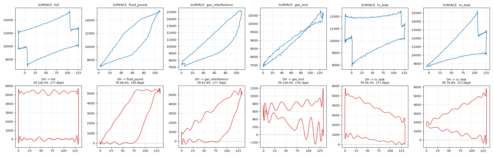

# SRP Dynacard Platform

A containerized system that ingests sucker-rod-pump (SRP) dynamometer cards,
computes the **downhole pump card** from the surface card via the Gibbs
wave-equation transform, **diagnoses** the pump condition, stores everything in
TimescaleDB, and serves both a fleet dashboard (Grafana) and an interactive
card-review UI. A physics-based **simulator** drives a 20-well field so the
whole stack is demoable end-to-end with no field hardware.

---

## What a dynacard is (and why the downhole card matters)

A dynamometer card is a closed loop of **polished-rod load vs. position** over
one pump stroke (200 samples/cycle, one cycle ≈ every 5 min). The *surface*
card is what a pump-off controller measures, but it is distorted by the
dynamics of a rod string thousands of feet long. The **downhole** card — what
is actually happening at the pump — is recovered by solving the damped wave
equation down the rod, and its shape is the diagnosis:



*Top: simulated surface cards. Bottom: the downhole card recovered by Gibbs,
with the automated diagnosis. Left to right: full pump, fluid pound, gas
interference, gas lock, traveling-valve leak, standing-valve leak.*

Diagnosis accuracy on 720 randomized wells (varied SPM, depth, stroke, fluid
load, damping): **94.9%**, with the residual confusion confined to the
inherently overlapping gas-family faults.

---

## Architecture

```
  POC / RTU (simulated)                 ┌──────────────────────────────┐
        │  surface cards                │        TimescaleDB           │
        ▼  MQTT srp/<well>/dynacard     │  wells (register)            │
  ┌────────────┐      ┌────────────┐    │  dynacards_raw  (hypertable) │
  │  Mosquitto │─────▶│   ingest   │───▶│  card_metrics   (hypertable) │
  └────────────┘      │  Gibbs +   │    │  card_metrics_hourly (cagg)  │
        ▲             │  diagnose  │    └──────────────┬───────────────┘
        │             └────────────┘                   │
  ┌────────────┐                          ┌────────────┴──────┐
  │ simulator  │  backfill (direct DB)    │       api         │  downhole
  │ 20 wells   │──────────────────────────▶  FastAPI, computes │  on demand
  └────────────┘                          └───┬───────────┬───┘
                                              │           │
                                    ┌─────────▼──┐   ┌────▼─────┐
                                    │  frontend  │   │ Grafana  │
                                    │ card review│   │  fleet   │
                                    └────────────┘   └──────────┘
```

**Design decisions that matter at 1000 wells / 1 year:**

- **One card = one row.** The 200 samples are stored as Postgres `real[]`
  arrays (~1.6 KB/card), never one row per sample. 1000 wells × 288 cards/day ≈
  288k rows/day (~3.3 writes/s) — a single Postgres node handles it comfortably.
- **Two tables.** `dynacards_raw` holds the heavy loops; `card_metrics` holds
  slim KPIs so every trend, alert, and dashboard query avoids the payload.
- **Store surface, derive downhole.** The Gibbs transform is microseconds, so
  the downhole card is computed on demand in the API rather than stored —
  halving raw storage and keeping the raw table canonical.
- **TimescaleDB does the lifecycle work.** Hypertables (1-day chunks),
  columnar compression after 7 days (~85–92% smaller), a declarative 365-day
  retention policy (the 1-year requirement), and an hourly continuous aggregate
  for long-range trends.
- **Grafana for the fleet, a custom UI for the card.** An XY pump loop is
  awkward in Grafana, so card review is a purpose-built oscilloscope-style
  viewer; fleet KPIs/alerts live in Grafana off `card_metrics`.

---

## Quick start

```bash
cp .env.example .env
docker compose up --build
```

First start seeds 20 wells, backfills 72 h of history (so dashboards have
trends immediately), then streams live cards. Give it a minute on cold start.

| Service            | URL                          | Notes                         |
|--------------------|------------------------------|-------------------------------|
| Card-review UI     | http://localhost:8080        | interactive surface+downhole  |
| Grafana            | http://localhost:3000        | admin / `admin` (see `.env`)  |
| API                | http://localhost:8000/api/health | FastAPI                   |
| Postgres           | localhost:5432               | srp / srp                     |
| MQTT               | localhost:1883               | anonymous                     |

---

## The physics core (`services/common/dynacard.py`)

Pure NumPy, shared by every service:

- `simulate_surface_card(well, condition, fillage)` — builds a textbook
  downhole pump card and propagates it **up** the rod string (inverse of the
  transfer matrix below) to produce a realistic surface card.
- `gibbs_downhole(position, load, well)` — solves `u_tt + c·u_t = a²·u_xx`
  harmonic by harmonic to propagate the measured surface card **down** to the
  pump. Simulator and transform share one transfer matrix whose determinant is
  1, so they are exact inverses.
- `diagnose(...)` — scale-free shape features (fillage, loop-area ratio,
  span ratio, upstroke droop, downstroke elevation, plateau length) feed a
  calibrated decision tree returning the fault label plus KPIs: PPRL, MPRL,
  fluid load, fillage %, and pump displacement (bbl/day).

---

## Layout

```
db/init/            schema (hypertables, compression, retention, cagg) + seed
services/common/    dynacard.py (physics), db.py, store.py  (shared)
services/simulator/ 20-well generator: history backfill + live MQTT
services/ingest/    MQTT subscriber -> Gibbs + diagnose -> Postgres
services/api/       FastAPI read API; computes downhole on demand
frontend/           React + SVG oscilloscope card viewer
grafana/            provisioned datasource + fleet dashboard
docker-compose.yml  full stack
```

## API

| Endpoint | Purpose |
|---|---|
| `GET /api/fleet` | latest status + diagnosis mix for every well |
| `GET /api/wells/{id}/cards?hours=` | card timestamps + KPIs (timeline) |
| `GET /api/wells/{id}/card?ts=` | one card: surface + computed downhole + KPIs |
| `GET /api/wells/{id}/metrics?hours=` | KPI time series (trends) |

## Tuning the simulator

Set in `.env`: `BACKFILL_HOURS` (history depth), `LIVE_INTERVAL` (seconds
between live rounds), `DO_BACKFILL` / `DO_LIVE`. Several wells intentionally
degrade from healthy to fluid-pound or gas-interference partway through the
window, so trends and the diagnosis timeline show real movement.

## Scaling to 1000 wells / multi-site

The compose stack is the pilot footprint. For production: put ingest behind a
shared MQTT broker (Sparkplug B) and scale it horizontally (idempotent writes
make this safe), keep one well-provisioned Postgres/Timescale node
(8–16 vCPU, 32–64 GB, NVMe) which covers the full 1000-well load, and move to
Kubernetes when spanning sites. No sharding or Kafka is warranted at this scale.
